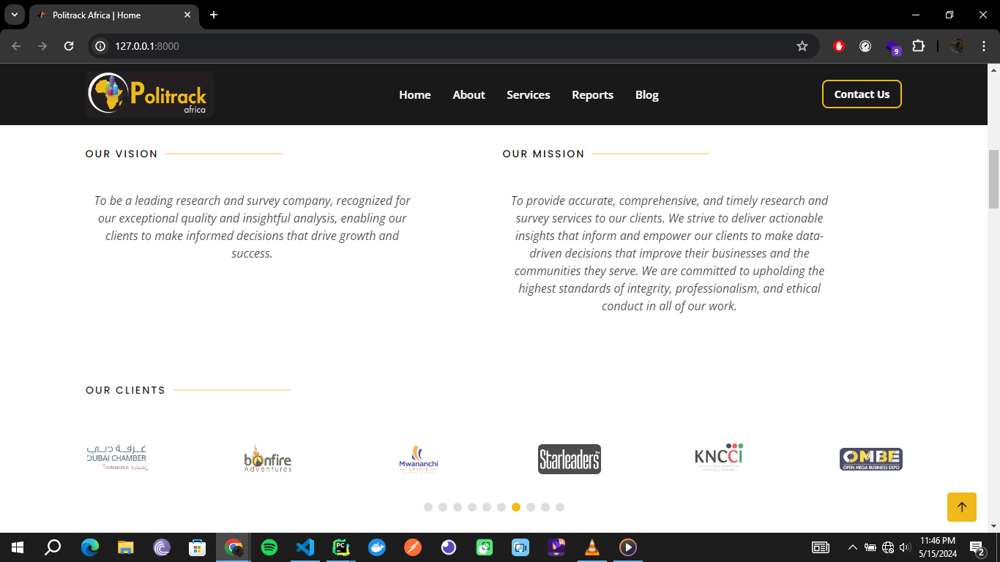
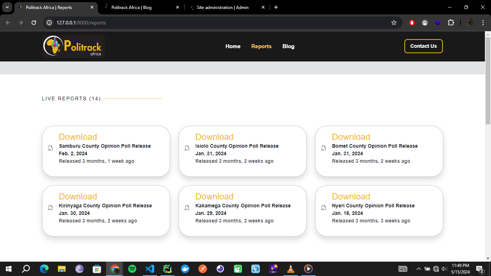
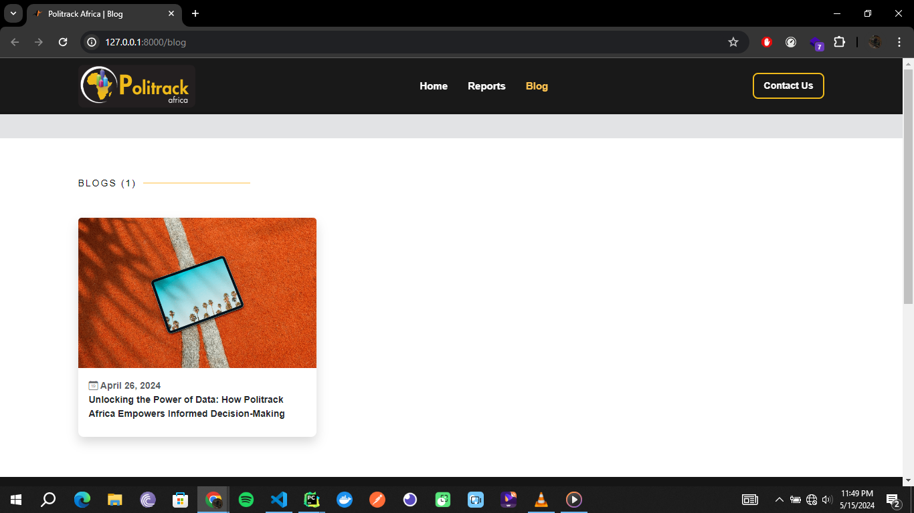
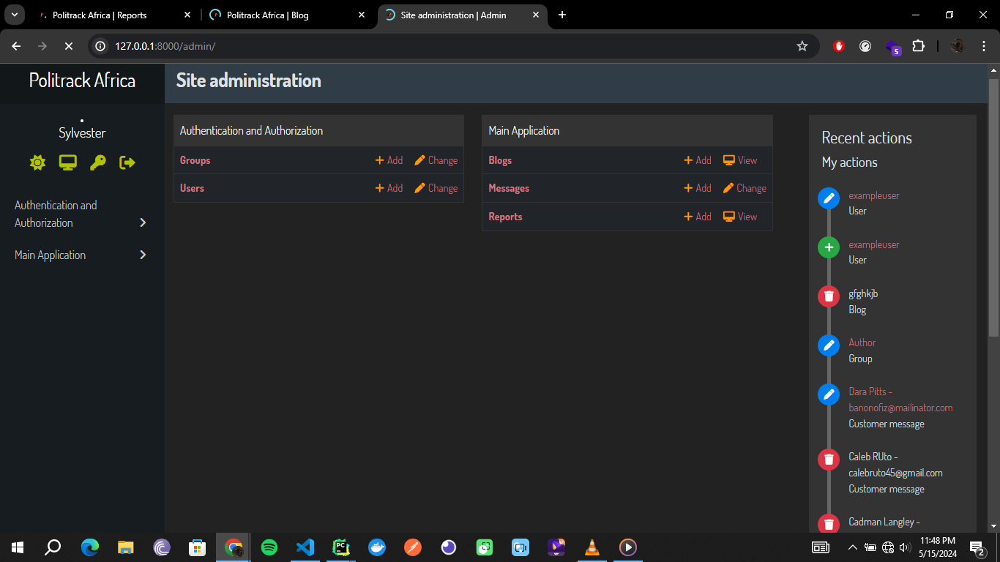

# Politrack Africa Application

## Demo

Explore the live version [here](https://politrack-africa-application.onrender.com/). Please note that due to hosting on
a free instance, there may be a cold boot time of approximately 60 seconds.

## Installation

1. Clone the repository.
2. Create a virtual env `python3 -m venv venv`
3. Activate the venv `venv\Scripts\activate`
4. Install dependencies: `pip install -r requirements.txt`.
5. Make database migrations: `python manage.py makemigrations`.
6. Set up the database: `python manage.py migrate`.
7. Create superuser: `python manage.py createsuperuser`.
8. Run the development server: `python manage.py runserver`

### Screenshots

